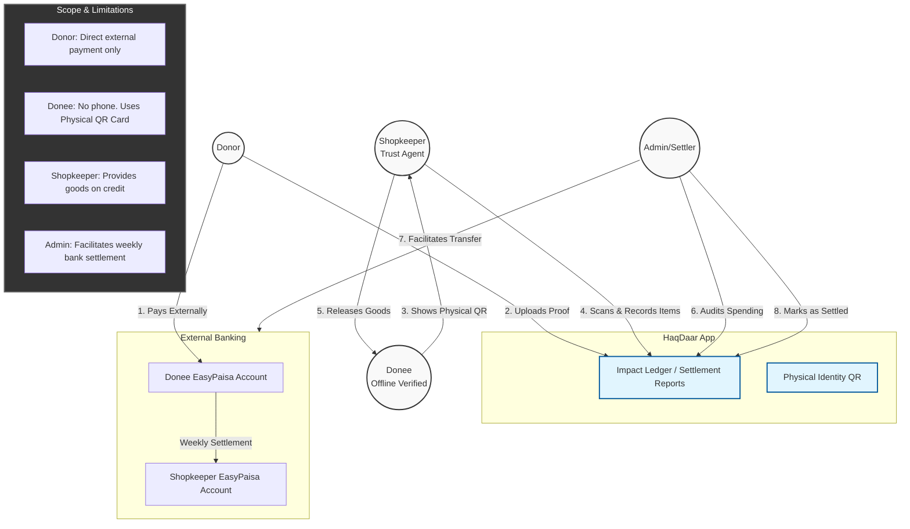

# HaqDaar: No-Custody Transparency Flow (Trust Agent Model)
**Concept: The App as a Witness, Not a Vault**

This document defines the "Trust Agent" model for the HaqDaar platform. This model is designed for **non-technical Donees** who do not have phones but have external EasyPaisa accounts.

---

## 1. User Flow & Interactions

---

## 2. Step-by-Step Cycle Details

### Step 1: Onboarding & Funding
*   **Action**: Admin verifies a Donee offline, creates an EasyPaisa account for them, and prints a **Physical QR Card**.
*   **Donation**: Donor sends money directly to the Donee's EasyPaisa.
*   **Verification**: Admin approves the Donor's proof. The app now shows the Donee as **"Funded"**.

### Step 2: In-Shop Transaction (Credit Basis)
*   **Action**: Donee visits an authorized Shopkeeper and presents their QR Card.
*   **Verification**: Shopkeeper scans the card with the HaqDaar app, verifies the Donee's photo and "Available Credit."
*   **Release**: Shopkeeper gives the goods and records the transaction in the app. 
*   **Status**: This record is marked as `Pending Settlement`.

### Step 3: Weekly Settlement
*   **Action**: Admin reviews the "Shopkeeper Settlement Report" in the app.
*   **Execution**: Admin facilitates the transfer from the Donee's EasyPaisa accounts to the Shopkeeper's account to cover the cost of goods released.
*   **Closing**: Admin marks the transactions as `Settled`.

---

## 3. Mandatory Terminology

| **Avoid (Prohibited)** | **Use Instead (Official)** |
| :--- | :--- |
| Wallet Balance | Impact Credit / Donation Record |
| Withdraw | Settlement / Release |
| App Transfer | External Bank Settlement |
| Top-up | Donor Proof Submission |

---

## 4. Key Rules
1.  **Direct Receipt**: Money always lands in the Donee's name first (Legal requirement).
2.  **Credit-First**: Shopkeepers act as agents by providing goods before the bank transfer happens.
3.  **Audit Trail**: Every bag of flour is linked to a Donor's verified receipt.
